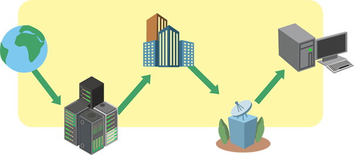
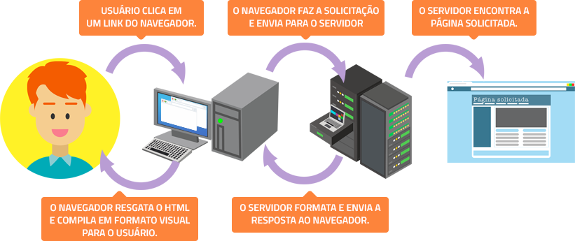

### Front-End - Como a intenet Funciona

1 - O que é a internet?

> A Internet é a espinha dorsal da Web, a infraestrutura técnica que faz a Web possível. Mas basicamente, a Internet é uma gigantesca rede de computadores que se comunicam juntos.

> A história da internet é um pouco obscura. Ela começou nos anos 60 como um projeto de pesquisa consolidado pelo exército norte americano, e tornou-se uma infraestrutura pública nos anos 80 com o suporte dado por diversas universidades públicas e companhias privadas. As várias tecnologias que suportam a internet evoluíram através do tempo, mas a forma de funcionamento não mudou muito: Internet é uma forma de conectar computadores e garantir, em qualquer situação, que eles encontrem uma forma de se manter conectados. 

    
2 - Funcionamento da internet

- Você já pensou como funciona a internet, a rede mundial de computadores?

> Em linhas gerais, a internet nada mais é que a comunicação entre dois computadores remotos. Esses computadores podem ser os populares desktops (computadores de mesa) ou mesmo as tablets, smartphone, smart tvs, etc. O fluxo de navegação da comunicação é bastante simples. Quando você, por exemplo, está conectado à internet e digita a URL de um site, na verdade está solicitando o acesso às informações que estão armazenadas em outro computador também ligado à rede que pode tanto ser de outro usuário (rede p2p) ou, mais provavelmente, um computador de uma empresa que funciona como servidor de hospedagem (rede convencional). Esse outro computador faz a leitura de sua solicitação e envia os arquivos em pacotes (taxa de download) para serem interpretados pelo seu navegador.

> Contudo, entre o momento que você pede acesso a determinada informação e de ela aparecer na sua tela, existe uma série de pessoas que atuam em diferentes estágios do fluxo, permitindo que toda a rede funcione bem e rápido… muito rápido.

> Agora veja, de forma bastante resumida, como se dá esse fluxo de navegação pela internet:

    
3 - Fluxo de navegação pela internet:

- `Computador do usuário`: quando conectado à internet, vira um terminal da rede. Pode tanto solicitar a consulta de dados quanto distribuir para outros usuários. Exemplos: desktop, smartphone, tablet, smart tv.

- `A conexão`: tipo de tecnologia que faz a ponte para a transferência de dados. Exemplos: ADSL, 3G, 4G, Dial-up.

- `Modem`: aparelho eletrônico que transmite os dados da internet para o computador do usuário. Ele libera o sinal através de um número de telefone único. Exemplos: modem a cabo, modem wireless (antena), modem 3G (USB).

- `TCP/IP`: TCP, significa Protocolo de Controle de Transmissão e IP, significa Protocolo de Internet. Ambos, significam a linguagem única para todos os computadores que permitirá o envio e a transmissão de dados.

- `Navegador`: toda informação transmitida pela internet é convertida em códigos. O navegador de internet é o software que transforma todos os códigos do site em: textos, vídeos e imagens para que o usuário possa visualizar. Exemplos: Google Chrome, Firefox Mozilla, Internet Explorer, Safari, Opera.

- `Provedor de internet`: empresa que detém a tecnologia que disponibiliza a internet no mundo. Geralmente as empresas provedoras são as que mais lucram com o acesso da internet.

- `Roteador`: organiza o tráfego de informações. Seu papel é o de levar a solicitação da informação ao servidor onde está alocado o conteúdo. Os roteadores, que estão ligados a uma enorme rede de provedores, agrupam as informações em pacotes e organizam o fluxo para que a informação chegue ao seu destino da maneira mais rápida possível.

- `Servidor de internet`: computadores que alocam informações de sites, e-mails, conteúdos nas nuvens, etc. Geralmente esses computadores são geridos por empresas que cobram para que outras empresas hospedem seus sites e demais arquivos. Exemplos: Locaweb, Kinghost, Hostnet, etc..

> OBS: Até o tópico acima, foi descrito apenas o caminho percorrido por uma solicitação de informação a algum servidor da internet.

- `Fluxo inverso`: Depois que a solicitação foi aprovada, o conteúdo segue todo esse fluxo no sentido inverso até chegar ao usuário (tópico 1) que o solicitou. E tudo isso acontece em fração de segundo!  

###### tags: `internet` `navegação`
